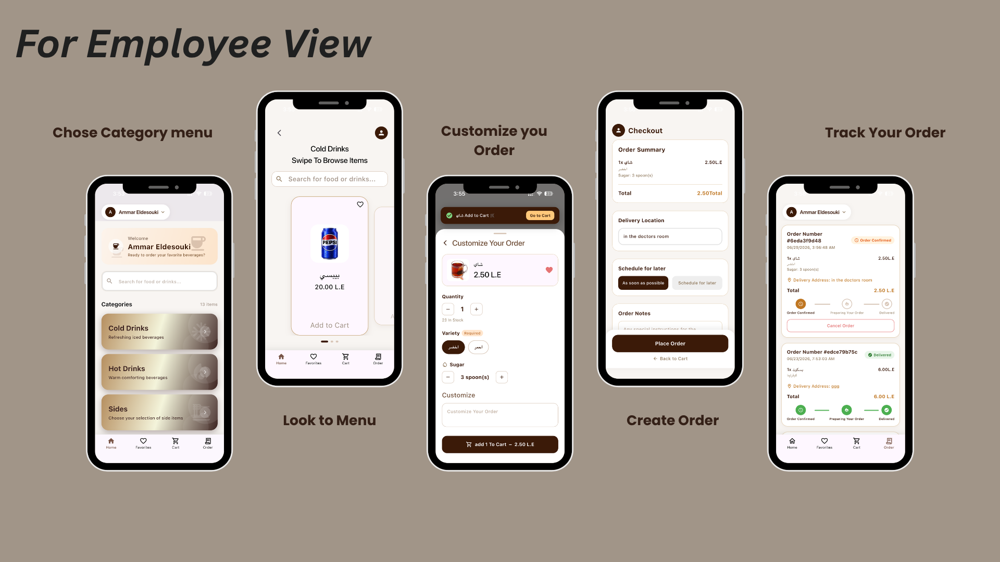
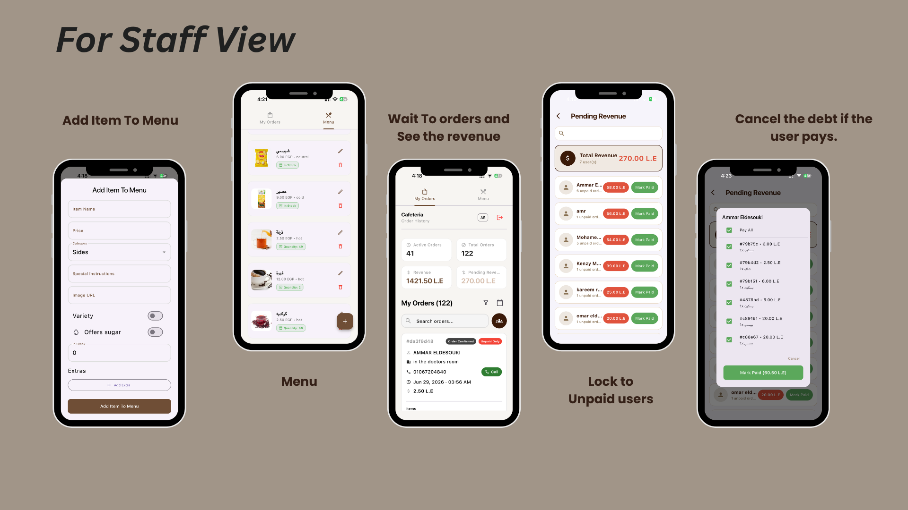
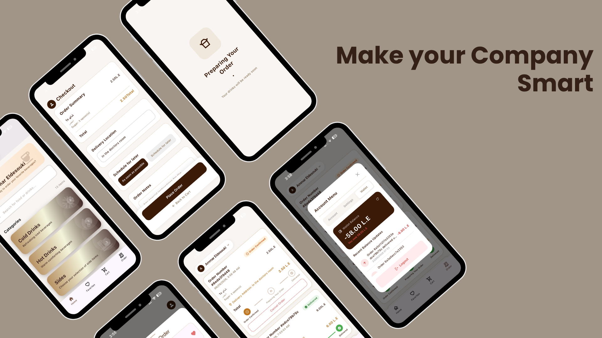

# OnTheWay — Cafeteria Management System

**OnTheWay** is a cafeteria ordering and management platform built for **CIC (Canadian International College)**. It lets employees order food and drinks from their desk and lets cafeteria staff manage the menu, fulfil orders, and settle payments — all in one app.

The project is a monorepo with two workspaces:

| Workspace | Stack | Path |
|-----------|-------|------|
| **Mobile app** | Flutter (Dart) | [`cafeteria/`](cafeteria/) |
| **Backend API** | Node.js · Express · MongoDB | [`cic-backend/`](cic-backend/) |

---

## Screenshots







---

## Features

The app has two roles, decided at login by the user's role.

### 👤 Employee / Customer
- **Browse the menu** by category (Cold Drinks, Hot Drinks, Sides) with a searchable catalogue.
- **Customize orders** — pick a variety/variant, sugar level, quantity, and add special instructions.
- **Favourites** — save the items you order most.
- **Cart & checkout** — set a delivery location, order now or **schedule for later**, and add order notes.
- **Live order tracking** — follow each order through *Order Confirmed → Preparing → Delivered*, and cancel while pending.
- **Wallet** — see your balance/debt and a feed of recent balance updates.
- **Bilingual** English / Arabic (full RTL) and **light / dark themes**.
- **Push notifications** for order status updates (Firebase Cloud Messaging).

### 🧑‍🍳 Cafeteria Staff / Admin
- **Menu management** — add, edit, and delete items (name, price, category, image, variety, sugar option, stock, and extras).
- **Stock control** — track in-stock quantities per item.
- **Order queue** — view active vs. total orders, browse order history, search, and call the customer directly.
- **Analytics** — realized **revenue** and **pending revenue** at a glance.
- **Debt settlement** — see each user's outstanding balance and **Mark Paid** (fully or per-order) when they settle up.

---

## Architecture

### Mobile app (`cafeteria/`)
**Clean Architecture** with feature-driven modules. Every feature under `lib/features/` follows the same three layers:

```
feature/
├── data/          # data_sources (DIO / SharedPreferences), models, repositories
├── domain/        # entities, repository interfaces, use_cases
└── presentation/  # manager (BLoC), pages, widgets
```

Cross-cutting concerns live in `lib/core/` — centralized routing (`AppRouter`), the `NetworkDioHandler` (DIO + auth-token interceptor), Material 3 theming, localization, constants, and the FCM service.

- **State management:** BLoC (`flutter_bloc`).
- **Dependency injection:** `GetIt` service locator, wired in `setupLocator()`.
- **Routing:** named routes via `onGenerateRoute`, which also injects each page's BLoC.
- **Localization:** ARB files in `lib/l10n/` are the source of truth (`flutter gen-l10n` regenerates the Dart).

### Backend (`cic-backend/`)
TypeScript **Express 5 + Mongoose (MongoDB)**, bundled with `tsup` and linted/formatted with **Biome**. Layered structure under `src/`:

```
routes/ → controllers/ → services/ → repositories/
```

- **Auth:** [`better-auth`](https://better-auth.com) plus custom routes; the app stores the issued JWT and sends it as `Authorization: Bearer <token>`.
- **Wallet / settlement:** orders are placed **unpaid** with no wallet movement. Money moves only on the `delivered` / `paid` transition, split between a per-user **debt ledger** and the **singleton cafeteria wallet**. Full model in `cic-backend/src/docs/WALLET_SYSTEM_EXPLAINED.md`.

---

## Getting Started

### Prerequisites
- [Flutter SDK](https://docs.flutter.dev/get-started/install) (with a device or emulator)
- [Node.js](https://nodejs.org/) 18+ and npm
- A MongoDB instance (local or hosted)

### Run the backend (`cic-backend/`)
```bash
cd cic-backend
npm install
cp .env.example .env      # then fill in MONGO_URI, auth secrets, etc.
npm run dev               # nodemon dev server on http://localhost:3001
```

Other backend scripts:
```bash
npm run build             # bundle with tsup → dist/
npm start                 # run the production build
npm run check             # Biome lint + format check
npm run format            # Biome auto-format
```

### Run the mobile app (`cafeteria/`)
```bash
cd cafeteria
flutter pub get
flutter gen-l10n          # required after editing .arb localization files
flutter run
```

By default the app talks to the deployed backend. To point it at a local backend, set `ApiConstants.baseUrl` in `lib/core/constants/` to:
- `http://10.0.2.2:3001/api/v1` — Android emulator
- `http://localhost:3001/api/v1` — iOS simulator

> **Firebase:** `cafeteria/lib/firebase_options.dart` is gitignored (contains API keys). Generate it with the [FlutterFire CLI](https://firebase.flutter.dev/docs/cli/) before running.

Other app commands:
```bash
flutter analyze                      # static analysis
flutter test                         # run tests
flutter test test/some_test.dart     # run a single test file
```
